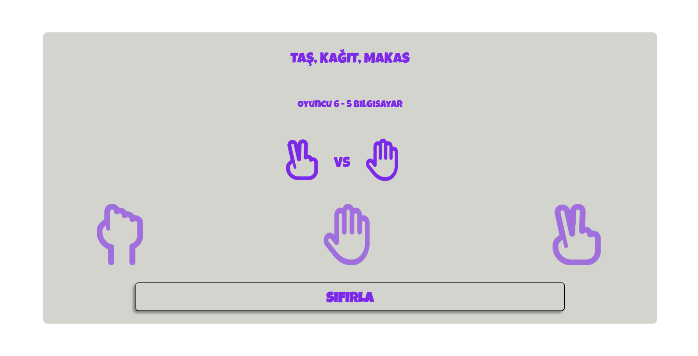

# Taş Kağıt Makas / Rock Paper Scissors

Bu, klasik **Taş Kağıt Makas** oyununu dijital ortamda oynayabileceğiniz basit bir uygulamadır.

This is a simple application to play the classic **Rock Paper Scissors** game digitally.

## Başlangıç / Getting Started

Projeyi bilgisayarınızda çalıştırmak için şu adımları takip edebilirsiniz:

You can follow these steps to run the project on your computer:

### Gereksinimler / Requirements

- Web tarayıcısı (Chrome, Firefox, vb.) / A web browser (Chrome, Firefox, etc.)

### Kullanım / Usage

1. Oyunu başlatın. / Start the game.
2. Taş, Kağıt veya Makas seçeneklerinden birini seçin. / Choose one of the Rock, Paper, or Scissors options.
3. Rakip (bilgisayar) bir seçim yapacak. / The opponent (computer) will make a choice.
4. Sonucu görün. / See the result.

### Kurulum / Installation

1. Bu repoyu bilgisayarınıza klonlayın: / Clone this repository to your computer:

    ```bash
    git clone https://github.com/furkansasi/rock-paper-scissors.git
    ```

2. Projeyi tarayıcınızda açarak oynayın! / Open the project in your browser and play!

## Kullanılan Teknolojiler / Technologies Used

- **HTML5** - Yapı / Structure
- **CSS3** - Stil / Styling
- **JavaScript** - İşlevsellik / Functionality

## Yazarlar / Authors

- **Furkan Sasi** - [furkansasi](https://github.com/furkansasi)

## Lisans / License

Bu proje **MIT Lisansı** altında lisanslanmıştır - detaylar için [LICENSE](LICENSE) dosyasına bakınız.

This project is licensed under the **MIT License** - see the [LICENSE](LICENSE) file for details.


